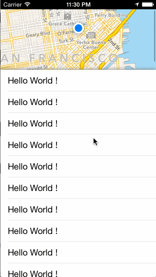

# SLParallaxController

Create a parallax effect between an UITableView and a MapView, like the view in FourSquare.



Sample usage is available in the `SLAppDelegate`.


## Requirements

`SLParallaxController` uses ARC and requires iOS 7.0+. Works for iPhone and iPad.<br />
Require the framework `MapKit`

## Installation

### CocoaPods

Add the following line to your Podfile:

```ruby
pod 'SLParallaxController'
```

Then run the following in the same directory as your Podfile:
```ruby
pod install
```

### Manual

Copy the folder `SLParallaxController` to your project.

## Usage

`SLParallaxController` is a subclass of `UIViewController` so you just need to instantiate a new one like this : `[SLParallaxController new]`

### Customization

You can customize the view by setting up properties below:

	- heighTableViewHeader : Height of the visible map on high position

	- Y_tableViewOnBottom : position of the TableView when it's down
	
	- minYOffsetToReach	: The minimum Y (TableView's contentOffset) 
						  to allow the 'displaying' of the map.
						  

###Handling User Interaction


These methods, defined in the `SLParallaxControllerDelegate` protocol, are called on the delegate when the user tap on the map or the tableView.

```` objective-c
-(void)didTapOnMapView;
-(void)didTapOnTableView;
````

These methods are called on the delegate when the tableView moved DOWN and UP.

```` objective-c
-(void)didTableViewMoveDown;
-(void)didTableViewMoveUp;
````


##License
	Copyright (c) 2014 stefanlage

	Permission is hereby granted, free of charge, to any person obtaining
	a copy of this software and associated documentation files (the
	"Software"), to deal in the Software without restriction, including
	without limitation the rights to use, copy, modify, merge, publish,
	distribute, sublicense, and/or sell copies of the Software, and to
	permit persons to whom the Software is furnished to do so, subject to
	the following conditions:

	The above copyright notice and this permission notice shall be
	included in all copies or substantial portions of the Software.

	THE SOFTWARE IS PROVIDED "AS IS", WITHOUT WARRANTY OF ANY KIND,
	EXPRESS OR IMPLIED, INCLUDING BUT NOT LIMITED TO THE WARRANTIES OF
	MERCHANTABILITY, FITNESS FOR A PARTICULAR PURPOSE AND
	NONINFRINGEMENT. IN NO EVENT SHALL THE AUTHORS OR COPYRIGHT HOLDERS BE
	LIABLE FOR ANY CLAIM, DAMAGES OR OTHER LIABILITY, WHETHER IN AN ACTION
	OF CONTRACT, TORT OR OTHERWISE, ARISING FROM, OUT OF OR IN CONNECTION
	WITH THE SOFTWARE OR THE USE OR OTHER DEALINGS IN THE SOFTWARE.
